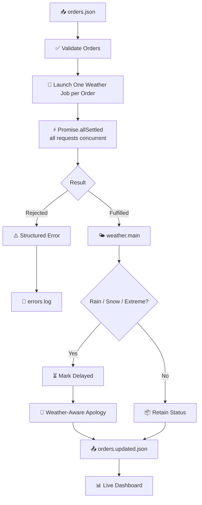

<div align="center">


<br/>

[](https://nodejs.org)
[](https://openweathermap.org/current)
[](#)
[](#testing)
[](#-live-dashboard)
[](#license)

</div>

---

## 🌦️ What is WeatherGuard?

**WeatherGuard** is a real-time Node.js engine that keeps delivery customers in the loop *before* they have to ask "where's my order?"

Point it at an order list, and it will:

1. **Fire off a live weather check for every order city at once** — no waiting in line.
2. **Flag any order heading into Rain, Snow, or Extreme conditions** as delayed.
3. **Write a genuinely personal apology** for each delayed customer — first name, city, condition, and a thank-you, with no API call required to generate it.
4. **Isolate failures** — an invalid or unreachable city gets logged and skipped, and every other order still gets processed.
5. **Show it all live** on a local dashboard, with a one-click button to trigger a fresh run.

No stale weather data, no silent failures, no generic "sorry for the delay" copy-paste.

---

## ✨ Features

- ⚡ **True concurrency** — every city's weather request is started in the same tick via `Promise.allSettled`
- 🌧️ **Deterministic delay rule** — `weather.main` of `Rain`, `Snow`, or `Extreme` → `Delayed`
- 💌 **Deterministic apology generator** — `createWeatherAwareApology()` needs no LLM call at runtime, so it's fast, free, and fully unit-testable
- 🛡️ **Failure isolation** — one bad city (or a dead API key) never takes down the rest of the batch
- 📝 **Structured error logging** — every failure is captured with timestamp, order ID, city, message, and status code
- 🔐 **Secrets stay in `.env`** — the API key is never hardcoded or exposed to the browser
- 📊 **Zero-dependency live dashboard** — streams the console in real time and re-runs the processor on demand
- ✅ **Automated test suite** covering the delay rule, concurrency/resilience, and the apology function

---

## 🧭 How It Works



---

## 💌 The Weather-Aware Apology

Every delayed order gets a message built from real order data — never a template placeholder:

- Uses the customer's **first name**
- Names the **destination city**
- Explains **why** the order is delayed in plain language
- Includes the human-readable weather description when available
- Closes with genuine thanks for the customer's patience

It's a pure, deterministic function — same inputs always produce the same sentence, and it never touches the network.

---

## 🛡️ Built to Survive Real-World Failures

- **Concurrent by design** — jobs are created for every order *before* anything is awaited, so all requests start together
- **`Promise.allSettled` failure isolation** — an invalid city becomes one rejected promise, not a crashed process
- **Structured error capture** — every failure is written to `output/errors.log` with enough context to debug later
- **No hardcoded secrets** — `OPENWEATHER_API_KEY` is loaded from `.env`, which is gitignored and never shipped to the browser

---

## 🧱 Tech Stack

| Layer          | Choice                                |
|----------------|----------------------------------------|
| Runtime        | Node.js 20+                            |
| Live data      | OpenWeatherMap Current Weather API     |
| Concurrency    | `Promise.allSettled`                   |
| Messaging      | Deterministic local apology generator  |
| Dashboard      | Zero-dependency local HTTP server      |
| Testing        | Automated unit tests (delay rule, concurrency, apology) |

---

## 🚀 Quick Start

```bash
cd weatherguard
cp .env.example .env      # add your OpenWeatherMap key
npm install
npm test                  # run the automated test suite
npm start                 # process orders.json against live weather
npm run verify:live       # sanity-check the generated artifacts
```

```env
OPENWEATHER_API_KEY=YOUR_REAL_KEY
```

**Outputs:**

```text
output/orders.updated.json   # every order, enriched + status-checked
output/errors.log            # structured, per-city failure records
```

Live delay results reflect **actual current weather** at the moment of the run — nothing here is hardcoded or fabricated.

---

## 📊 Live Dashboard

A zero-dependency dashboard ships alongside the processor:

```bash
npm run dashboard
```

Open **http://127.0.0.1:4173** to:

- Watch orders and errors stream in as they happen
- Trigger a brand-new live run with the **Run Weather Check** button
- Confirm the API key never reaches the browser — the dashboard server loads `.env` and launches the processor itself

---

## 🧪 Testing

```bash
npm test
```

Covers:

- The `Rain` / `Snow` / `Extreme` → `Delayed` rule
- Concurrent request behavior and failure isolation
- The `createWeatherAwareApology()` output

---

## 📂 Project Structure

```text
weatherguard/
├── .env.example
├── package.json
├── orders.json
├── src/
├── test/
├── dashboard/
├── dashboard-server.mjs
└── output/
    ├── orders.updated.json
    └── errors.log
```

`.env` is created locally and is never committed.

---

## 🔐 Security

- The real API key lives only in `.env`
- `.env` is gitignored
- Source code contains no hardcoded credentials
- The browser-facing dashboard never receives the key directly

---

## 🗺️ Roadmap

- [ ] Multi-provider weather fallback (in case one API is down)
- [ ] Configurable delay conditions beyond Rain/Snow/Extreme
- [ ] Webhook/email delivery of apology messages
- [ ] Historical delay analytics on the dashboard

---

## 📜 License

Released under the **MIT License**.

<div align="center">


</div>
